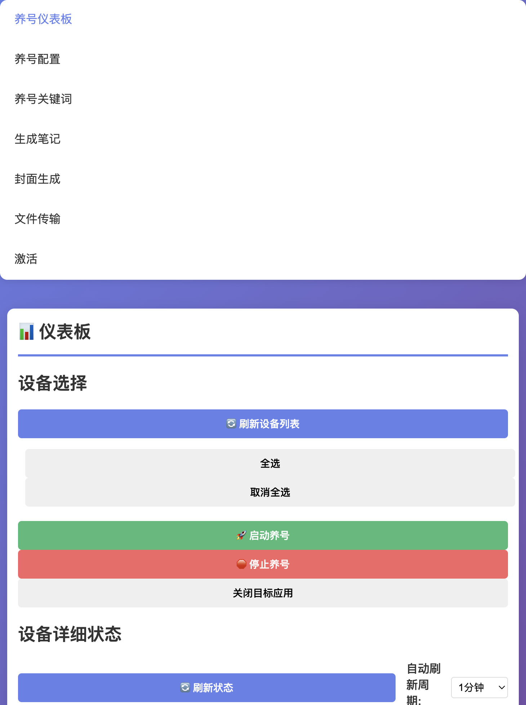
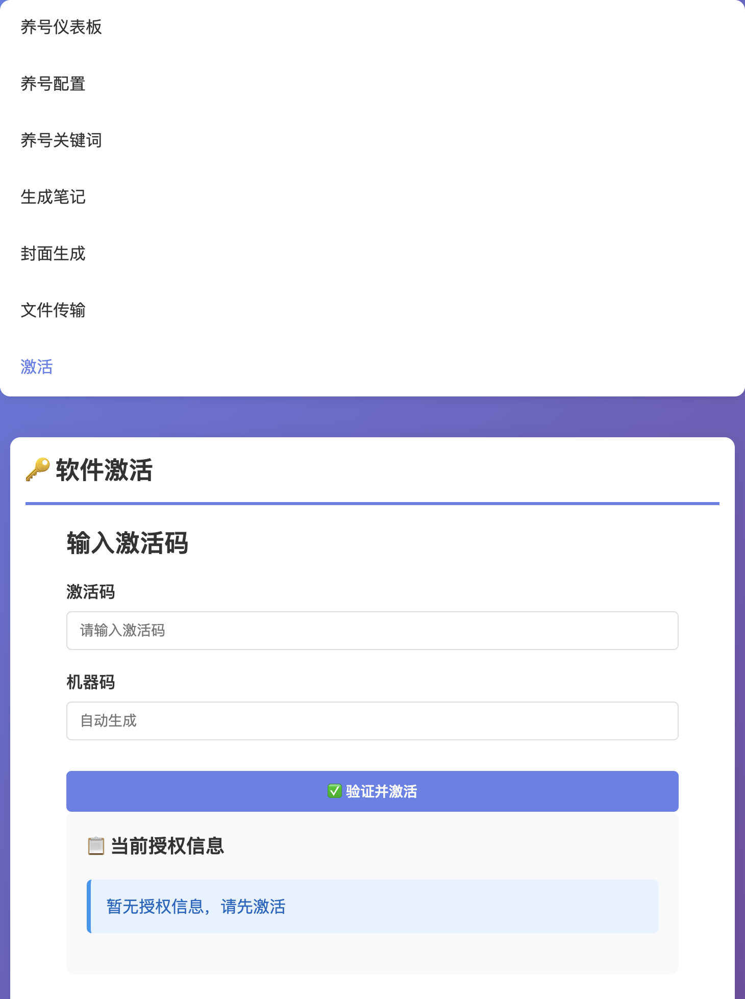
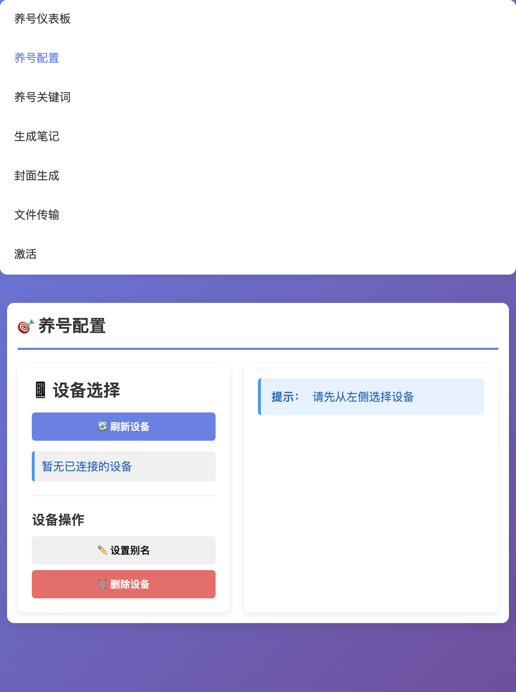
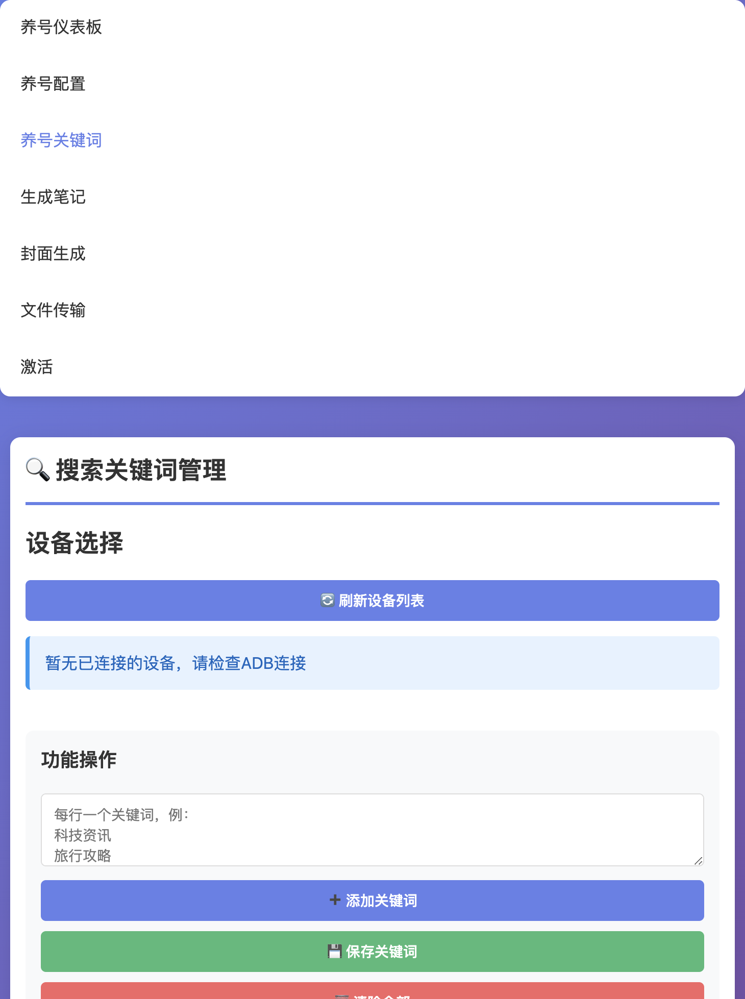
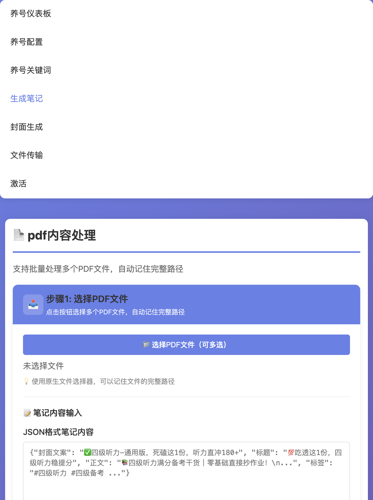
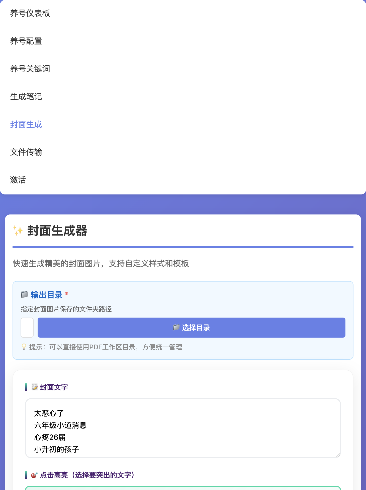
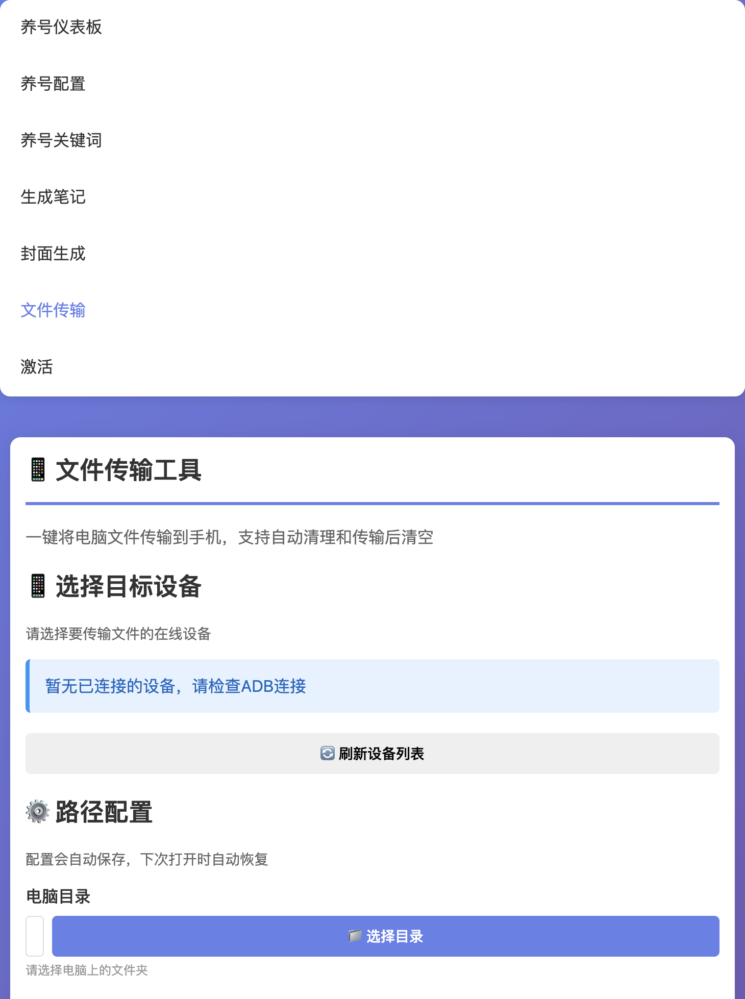

# 创作助手 PC 端 · 操作手册

> 版本：v1.0.0 ｜ 适用平台：Windows / macOS

---

## 目录

1. [安装与启动](#1-安装与启动)
2. [激活授权](#2-激活授权)
3. [养号仪表板](#3-养号仪表板)
4. [养号配置](#4-养号配置)
5. [养号关键词](#5-养号关键词)
6. [生成笔记（PDF 转图片）](#6-生成笔记pdf-转图片)
7. [封面生成](#7-封面生成)
8. [文件传输](#8-文件传输)
9. [常见问题](#9-常见问题)
10. [日志与数据存储位置](#10-日志与数据存储位置)

---

## 1 安装与启动

### 1.1 系统要求

| 项目 | 要求 |
|------|------|
| 操作系统 | Windows 10/11 64 位 或 macOS 12+ |
| 手机连接 | ADB 调试已开启，USB 连接或 WiFi 同局域网 |
| PDF 功能（可选） | 安装 Poppler（生成笔记功能需要） |

### 1.2 首次启动

1. 解压下载的压缩包，找到 `creator_helper.exe`（Windows）或 `creator_helper`（macOS）
2. 双击运行，等待蓝色加载页面消失后进入主界面
3. 首次启动需要联网验证授权，请确保网络畅通

> **注意（macOS）**：首次运行可能提示"无法验证开发者"，前往  
> 系统设置 → 隐私与安全性 → 点击"仍要打开"即可。

启动完成后进入主界面如下：

---

## 2 激活授权

### 2.1 获取机器码

点击顶部导航栏 **「激活」** 进入授权页面，页面上方显示当前设备的**机器码**，将此码发给服务商获取激活码。

### 2.2 输入激活码

1. 在激活码输入框中填入服务商提供的激活码
2. 点击 **「立即激活」**
3. 激活成功后页面显示套餐类型、到期日期及各功能每日使用限额

### 2.3 套餐说明

| 套餐 | 每日养号次数 | 每日生成笔记 | 每日封面生成 | 设备数量 |
|------|------------|------------|------------|---------|
| 免费版 | 3 次 | 5 次 | 5 次 | 1 台 |
| 基础版 | 9 次 | 15 次 | 30 次 | 3 台 |
| 专业版 | 不限 | 不限 | 不限 | 不限 |

---

## 3 养号仪表板

**路径**：导航栏 → 养号仪表板

养号仪表板是日常操作的主界面，提供一键启停和实时状态监控。

### 3.1 设备选择

- 点击 **「刷新设备列表」** 获取当前已连接的手机设备
- 勾选需要养号的设备（支持多选，点击 **「全选」** 批量选中）
- 设备卡片显示设备 ID / 别名及当前在线状态

### 3.2 启动 / 停止养号

| 按钮 | 功能 |
|------|------|
| 启动养号 | 对所有选中设备同时开始养号，按已保存的配置执行 |
| 停止养号 | 立即中止所有正在进行的养号任务 |
| 关闭目标应用 | 在手机上关闭目标 App（养号结束后清场用） |

### 3.3 设备状态与日志

- **设备详细状态** 区域实时显示每台设备的运行进度
- 可设置自动刷新周期（1 / 5 / 10 分钟）
- **最近操作日志** 展示本次会话内的关键操作记录

---

## 4 养号配置

**路径**：导航栏 → 养号配置

在此页面可以为每台设备单独配置养号行为参数。

### 4.1 选择设备

从左侧设备面板点击要配置的设备，右侧会显示该设备当前的配置参数。

- **设置别名**：给设备起一个易记的名称（如"主力机 1"）
- **删除设备**：从系统中移除该设备的配置记录

### 4.2 核心参数

进入设备配置后，右侧展示完整配置表单（与「参数配置」页面相同）：

| 参数 | 说明 | 默认值 |
|------|------|--------|
| 养号时间 | 单次养号持续时长（分钟） | 20 分钟 |
| 访问帖子比例 | 搜索结果中随机访问的帖子比例 | 50% |
| 每关键词最多访问帖子数 | 单个关键词下最多打开的帖子数 | 10 条 |
| 发现页浏览时间 | 进入 App 后在首页停留的时间 | 10 秒 |

### 4.3 互动行为设置

| 参数 | 说明 |
|------|------|
| 点赞概率 | 访问帖子时随机点赞的概率（%） |
| 收藏概率 | 随机收藏帖子的概率（%） |
| 评论概率 | 随机发表评论的概率（%） |
| 访问主页概率 | 随机进入作者主页的概率（%） |
| 评论模板 | 预设评论词库，随机抽取发送 |

---

## 5 养号关键词

**路径**：导航栏 → 养号关键词

为每台设备配置搜索关键词，养号时将依次搜索这些词并访问相关内容。

### 5.1 添加关键词

1. 从设备列表选择目标设备
2. 在输入框填写关键词（每行一个，或逗号分隔）
3. 点击 **「保存关键词」**

**建议**：每台设备配置 5～15 个关键词，关键词与目标内容领域相关。

---

## 6 生成笔记（PDF 转图片）

**路径**：导航栏 → 生成笔记

将 PDF 文件转换为可直接发布的图片，支持多种排版和水印设置。

### 6.1 操作步骤

**第 1 步：选择 PDF 文件**
- 点击 **「选择 PDF 文件」** 按钮，可多选
- 支持拖拽文件到上传区域

**第 2 步：配置转换参数**

| 参数 | 说明 |
|------|------|
| 图片尺寸 | 选择输出图片的分辨率/比例 |
| 水印文字 | 在图片上叠加自定义文字水印 |
| 水印位置 | 水印出现的位置（右下角等） |
| 水印透明度 | 水印的显示透明程度 |
| 页眉 / 页脚图片 | 在每张图片顶部/底部添加品牌图片 |

**第 3 步：转换并下载**
- 点击 **「开始转换」** 等待处理完成
- 转换完成后点击 **「下载全部图片」** 或逐张下载

> **前提条件**：生成笔记功能需要安装 Poppler 工具。  
> - Windows：从 [poppler-windows](https://github.com/oschwartz10612/poppler-windows) 下载解压，将 `bin/` 目录加入系统 PATH  
> - macOS：终端执行 `brew install poppler`

---

## 7 封面生成

**路径**：导航栏 → 封面生成

快速生成平台内容封面图片，支持自定义文字、样式和背景。

### 7.1 基本流程

1. 选择封面模板或上传背景图
2. 填写标题文字、副标题
3. 调整字体、颜色、位置
4. 点击 **「生成封面」** 预览
5. 满意后点击 **「下载」** 保存到本地

---

## 8 文件传输

**路径**：导航栏 → 文件传输

将电脑上的文件一键传输到已连接的手机，免去手动拖拽。

### 8.1 路径配置

| 字段 | 说明 |
|------|------|
| 电脑目录 | 要传输的文件所在的本地文件夹 |
| 手机目录 | 手机上接收文件的目录路径 |

推荐手机目录：`/sdcard/Android/media/传输专用目录`

### 8.2 传输操作

| 按钮 | 功能 |
|------|------|
| 清理手机目录 | 删除手机端指定目录内的所有文件 |
| 传输到手机 | 仅传输文件，不清理手机目录 |
| 清理并传输 | 先清空手机目录，再传输电脑文件（推荐每次使用前执行） |
| 手机 → 电脑 | 将手机目录的文件下载到电脑 |

---

## 9 常见问题

### Q1：设备列表为空，找不到手机？

1. 确认手机已开启 **USB 调试**（开发者选项中）
2. 使用数据线连接后，手机弹出"允许 USB 调试"，选择**始终允许**
3. 回到软件点击**刷新设备列表**

WiFi 连接方式：先用 USB 连接后在手机终端执行  
`adb tcpip 5555`  
然后执行 `adb connect 手机IP:5555`，之后可拔掉数据线。

---

### Q2：启动后一直显示加载界面？

- 检查杀毒软件是否拦截了程序（将 `creator_helper.exe` 加入白名单）
- 查看日志文件确认报错原因（见第 10 节）

---

### Q3：生成笔记时报错"Poppler 未安装"？

按第 6.1 节安装 Poppler，安装后**重启软件**。

---

### Q4：激活码提示"无效"？

- 确认激活码没有多余空格
- 确认当前设备机器码与购买时一致
- 若更换了电脑，需联系服务商更换绑定设备

---

### Q5：每日次数用完后还能继续吗？

每天凌晨 0 点自动重置。或升级为更高级套餐获得更多每日次数。

---

## 10 日志与数据存储位置

### 运行日志

| 平台 | 路径 |
|------|------|
| Windows | `C:\Users\你的用户名\.creator_helper\logs\creator_helper.log` |
| macOS | `~/.creator_helper/logs/creator_helper.log` |

日志文件自动滚动，单文件最大 5 MB，保留最近 3 份。

### 授权数据库

授权信息存储在系统隐藏目录中，**不在软件安装目录内**，普通用户无需关注：

| 平台 | 路径 |
|------|------|
| Windows | `%LOCALAPPDATA%\Microsoft\EdgeData\` |
| macOS | `~/Library/Application Support/com.apple.updates/` |

---

*如有问题请联系技术支持。*
